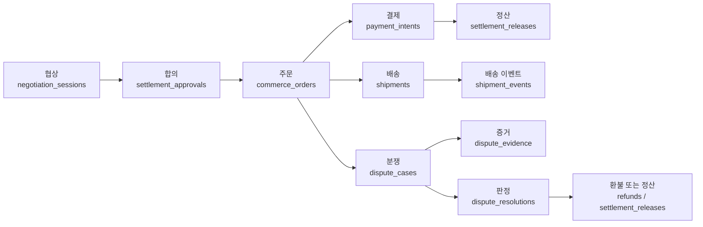

# Haggle 데이터베이스 한눈에 보기

> 대상: 처음 저장소를 읽는 사람과 AI 에이전트. 테이블 정의 자체는 `packages/db/src/schema`, 배포 이력은 `packages/db/drizzle`이 최종 기준이다.

## 먼저 알아야 할 것

Haggle은 결제 DB, 배송 DB, 분쟁 DB를 별도 제품으로 운영하지 않는다. **환경마다 하나의 PostgreSQL 데이터베이스**가 있고, 그 안에서 기능별 장부를 논리적으로 분리한다.

| 환경 | 목적 | 데이터 취급 | 변경 경로 |
|---|---|---|---|
| Local | 개발, 자동 테스트, migration replay | 가짜 데이터 또는 개발자 전용 데이터 | 로컬 `DATABASE_URL` + `pnpm --filter @haggle/db db:migrate` |
| Staging | 팀 통합 테스트와 배포 리허설 | 운영과 분리된 팀 테스트 데이터 | feature PR → `staging`, 배포 secret의 `DATABASE_URL` |
| Production | 실제 사용자 거래 | 실제 돈, 주소, 증거 등 민감 데이터 | 검증된 `staging` → `main`만 허용 |

`DATABASE_URL`이 어느 물리 DB를 사용할지 결정한다. 별도 `STAGING_DATABASE_URL`을 코드 계약으로 만들지 않는다. Supabase는 PostgreSQL/Auth/Storage 인프라를 제공하지만, 스키마 migration의 단일 소스는 Drizzle이다.

## 거래의 중심 흐름



`commerce_orders.id`인 `order_id`가 결제, 배송, 분쟁을 묶는 공통 거래 번호다. 각 영역은 자기 상태만 변경하고 다른 장부의 상태를 직접 덮어쓰지 않는다.

## 논리 영역 카탈로그

| 영역 | 무엇을 저장하는가 | 대표 테이블 | 주 writer/reader |
|---|---|---|---|
| 인증·지갑 | 인증 기록, 인증 이벤트, 사용자 지갑, 짧은 WebSocket 인증권 | `authentications`, `authentication_events`, `user_wallets`, `websocket_auth_tickets` | auth routes/services, websocket auth job |
| 리스팅·수요 | 판매 초안/공개 상품, 구매자 관심, 대기 수요와 매칭 | `listing_drafts`, `listings_published`, `buyer_listings`, `waiting_intents`, `intent_matches` | listing/intents routes, matching services |
| 협상 | 그룹, 세션, 라운드, 전략 checkpoint, 검증과 LLM 사용량 | `negotiation_groups`, `negotiation_sessions`, `negotiation_rounds`, `negotiation_checkpoints`, `llm_telemetry` | negotiation routes, pipeline/executor |
| 합의·주문 | 양측이 승인한 가격/조건 스냅샷과 거래의 상위 식별자 | `settlement_approvals`, `commerce_orders` | negotiation acceptance, payment record service |
| 주소 | 주문 당시 주소 스냅샷과 사용자 저장 주소 | `order_addresses`, `user_saved_addresses` | shipment routes/address service |
| 결제 | 결제 의도, 권한 부여, 결제 완료, 환불, provider 기능 | `payment_intents`, `payment_authorizations`, `payment_settlements`, `refunds`, `payment_provider_capabilities` | payment routes/services, Stripe/x402 handlers |
| 정산 | 배송과 분쟁이 끝날 때까지 상품대금과 운임 buffer의 보류/해제 | `settlement_releases` | settlement release service/jobs |
| 배송 | 발송, 라벨, 추적 이벤트, 요금 제한과 사후 운임 조정(APV) | `shipments`, `shipment_events`, `shipment_apv_*` | shipment routes/services, EasyPost webhook/jobs |
| 분쟁 | 사건, 격리 업로드, 증거, AI 심사, 사람 검토, 판정과 보증금 | `dispute_cases`, `dispute_evidence`, `dispute_evidence_uploads`, `dispute_ai_assessment_events`, `dispute_resolutions`, `dispute_deposits` | dispute/reviewer routes, dispute jobs |
| 신뢰·검토 | 신뢰 점수/패널티, 정산 신뢰도, reviewer/DS 전문성 | `trust_scores`, `trust_penalty_records`, `settlement_reliability_snapshots`, `reviewer_profiles`, `ds_ratings` | trust/reviewer services |
| 태그·추천·시장지능 | 태그 그래프, embedding, 가격 관측, 추천/대화 신호와 기억 | `tags`, `tag_edges`, `listing_embeddings`, `hfmi_price_observations`, `conversation_market_signals`, `evermemos` | tag/recommendation/intelligence services |
| 알림 | 사용자 알림 설정, 인앱 알림, 이메일 전달 상태 | `notification_preferences`, `notifications`, `email_deliveries` | notification/email jobs |
| 운영·감사 | webhook 중복 방지, API rate limit, chain cursor, 관리자 감사 | `webhook_idempotency`, `api_rate_limit_windows`, `chain_sync_cursors`, `admin_action_log` | middleware, webhook workers, admin/jobs |
| 테스트 조정 | 테스트 콘솔의 긴 작업 lease와 충돌 방지 | `payment_test_operation_leases` | payment test tools only |

## 핵심 거래 테이블 사전

| 테이블 | 한 줄 설명 | 주요 연결 키 | 상태 변경 소유자 |
|---|---|---|---|
| `settlement_approvals` | 협상에서 양측이 최종 승인한 가격, 결제 rail, 배송 조건의 스냅샷 | `id`, `buyer_id`, `seller_id` | negotiation/settlement approval API |
| `commerce_orders` | 결제·배송·분쟁을 묶는 거래의 상위 장부 | `id=order_id`, `settlement_approval_id` | payment record/order service |
| `order_addresses` | 주문 시점의 발송지·수령지 스냅샷 | `order_id` | shipment address flow |
| `payment_intents` | 결제를 시도하는 금액, rail, legacy/canonical 상태와 provider context | `id=payment_intent_id`, `order_id` | payment service, payment expiry job |
| `payment_authorizations` | 결제 수단이 금액 사용을 승인했다는 provider 기록 | `payment_intent_id` | Stripe/x402 payment handler |
| `payment_settlements` | 자금 이동이 완료됐다는 provider/on-chain 기록 | `payment_intent_id` | payment settlement handler |
| `refunds` | 부분/전체 환불과 외부 참조 | `payment_intent_id` | refund/dispute finalization flow |
| `settlement_releases` | 상품대금과 배송 buffer를 보류하고 해제하는 정산 장부 | `payment_intent_id`, `order_id` | settlement release service/jobs |
| `shipments` | 주문별 발송·라벨·추적·환불 상태의 현재 스냅샷 | `id=shipment_id`, `order_id` | shipment service, EasyPost webhook |
| `shipment_events` | 배송 상태 변화의 append-only 이벤트 이력 | `shipment_id` | shipment event service |
| `dispute_cases` | 주문별 분쟁 사건과 현재 review 상태 | `id=dispute_id`, `order_id` | dispute routes/jobs |
| `dispute_evidence_uploads` | 업로드 intent, 격리/검사, 카메라 binding과 보존 상태 | `dispute_id`, `committed_evidence_id` | evidence upload/scanner services |
| `dispute_evidence` | 검사를 통과해 사건에 채택된 append-only 증거 | `dispute_id` | dispute record/evidence commit service |
| `dispute_ai_assessment_events` | AI 심사의 입력 hash, 모델, 판정과 재심 이력 | `dispute_id` | dispute AI assessment service |
| `dispute_resolutions` | 최종 결과, 판결문 요약, 환불 금액 | `dispute_id` | resolution/finalizer service |
| `webhook_idempotency` | 외부 event를 source별로 한 번만 처리하기 위한 claim/lease | `(source,idempotency_key)` | webhook event claim service |
| `admin_action_log` | 관리자와 운영 도구의 민감 작업 감사 이력 | `target_type`, `target_id` | admin action log service |

## 결제 보조 장부

| 테이블 묶음 | 역할 |
|---|---|
| `agent_payment_grants`, `payment_disclosures` | 구매자가 agent에 부여한 결제 한도/기간/rail과 법적 고지 동의 |
| `payment_operation_idempotency` | 결제 command의 중복 실행 및 충돌 방지 |
| `payment_provider_capabilities` | Stripe/x402 등 provider별 지원 기능과 readiness |
| `payment_test_operation_leases` | 테스트 콘솔의 장시간 결제 시나리오 동시 실행 방지 |

## 배송 APV 장부

APV(Actual Postage Variance)는 협상 시 추정한 운임과 carrier의 실제 청구액 차이를 처리한다.

| 테이블 묶음 | 역할 |
|---|---|
| `shipment_apv_adjustments`, `shipment_apv_adjustment_revisions` | 원 운임, 실제 운임, 차액과 수정 이력 |
| `shipment_apv_payout_offsets`, `shipment_apv_payout_offset_allocations` | 판매자 책임액을 다음 정산에서 상계하는 예약/배분 장부 |
| `shipment_apv_seller_liabilities` | 아직 회수하지 못한 판매자 책임액 |
| `shipment_apv_payout_cancellation_*` | 만료되거나 잘못된 상계 예약의 취소 승인·이벤트·감사 outbox |
| `shipment_apv_invoice_*` | carrier invoice 문서, reconciliation, 손상 문서 복구와 remediation |
| `shipment_apv_failure_alert_*` | APV 실패 감지, 승인, 서명, 전달, 수신 claim |
| `shipment_apv_manifest_archive_alert_*` | receiver manifest archive 경보의 승인·서명·전달·수신 claim |
| `shipment_apv_remediation_*` | 복구 cursor 보존과 운영 지표 |

`shipment_apv_failure_alert_*`, `shipment_apv_manifest_archive_alert_*`, `shipment_apv_remediation_*` 중 23개 운영 테이블은 고급 trigger 때문에 raw SQL이 소유한다. 정확한 목록과 owner는 `packages/db/schema-ownership.json`에서만 관리한다.

## 분쟁 증거·감사 장부

| 테이블 묶음 | 역할 |
|---|---|
| `dispute_evidence_similarity_review_*` | 동일/유사 사진 재사용 탐지와 사람 검토 감사 |
| `dispute_evidence_provenance_archive_outbox` | 파생 증거 provenance를 외부 archive로 보내는 outbox |
| `dispute_evidence_scanner_circuits`, `dispute_evidence_scanner_permits` | 악성 파일 scanner 장애 시 circuit breaker와 제한된 probe 권한 |
| `dispute_evidence_scan_retry_alert_*` | 검사 재시도 장애 경보, snapshot, 보존 상태 |
| `dispute_ai_audit_outbox`, `dispute_ai_audit_discovery_failures` | AI 판정 감사 archive와 누락 탐지 실패 |
| `dispute_ai_assessment_leases`, `dispute_operation_leases` | 중복 AI 판정·해결·항소 실행 방지 |
| `dispute_module_idempotency_keys`, `dispute_module_webhook_outbox` | 외부 플랫폼 분쟁 모듈의 중복 요청과 webhook 전달 |

## 데이터 민감도

| 등급 | 예시 | 원칙 |
|---|---|---|
| 매우 민감 | 주소, 전화번호, 결제 provider context, 지갑, 분쟁 원본 증거 | 일반 로그/대시보드 노출 금지, 최소 권한, 필요 시 서명 URL |
| 거래 민감 | 가격, 결제/환불 금액, 정산 상태, 판결문 | 당사자·관리자 권한 확인, idempotency와 감사 필요 |
| 운영 민감 | claim id, lease, webhook payload hash, 오류 원문 | 외부 응답에서 redaction, 운영자에게도 bounded summary |
| 공개 가능 | 공개 리스팅, 공개 태그, 집계 통계 | 개인·거래 식별자와 결합되면 다시 민감 데이터로 취급 |

## 에이전트 작업 라우팅

| 작업 | 먼저 읽을 곳 | 실제 코드 확인 |
|---|---|---|
| 테이블 의미 파악 | 이 문서 | `packages/db/src/schema/<domain>.ts` |
| 기존/신규 DB 차이와 변경 승인 | `database-structure-and-governance.md` | `packages/db/drizzle`, `meta/_journal.json` |
| 결제 변경 | 결제/정산 행 | `payments.ts`, `settlement-releases.ts`, payment routes/services |
| 배송 변경 | 배송/APV 행 | `shipments.ts`, `shipment-apv-*.ts`, shipment routes/services |
| 분쟁 변경 | 분쟁/증거 행 | `disputes.ts`, `dispute-evidence-*.ts`, dispute routes/services |
| raw SQL 테이블 변경 | 배송 APV 장부 | `schema-ownership.json`과 해당 migration/service |
| 실제 DB 적용 전 확인 | 변경 규칙 | `pnpm db:preflight:compat`, `pnpm db:audit:relations` |

에이전트는 이 문서만 보고 컬럼이나 관계를 추측하지 않는다. 항상 schema, migration, 실제 writer를 함께 확인한다.

## Source of Truth와 안전 명령

1. 배포 이력: `packages/db/drizzle/*.sql`, `packages/db/drizzle/meta/_journal.json`
2. 현재 ORM 모델: `packages/db/src/schema/*.ts`
3. raw SQL 소유권: `packages/db/schema-ownership.json`
4. 관리 FK 목록: `packages/db/transaction-relations.json`
5. 실제 행동: `apps/api/src/routes`, `apps/api/src/services`, `apps/api/src/jobs`

```bash
pnpm verify:migrations
pnpm verify:db-invariants
pnpm db:preflight:compat
pnpm db:audit:relations
```

스키마를 바꿀 때는 기존 migration을 수정하지 않고 새 additive migration을 만든다. 배포 전후 절차와 `NOT VALID` 관계 검증은 [거래 DB 구조와 변경 규칙](./database-structure-and-governance.md)을 따른다.
