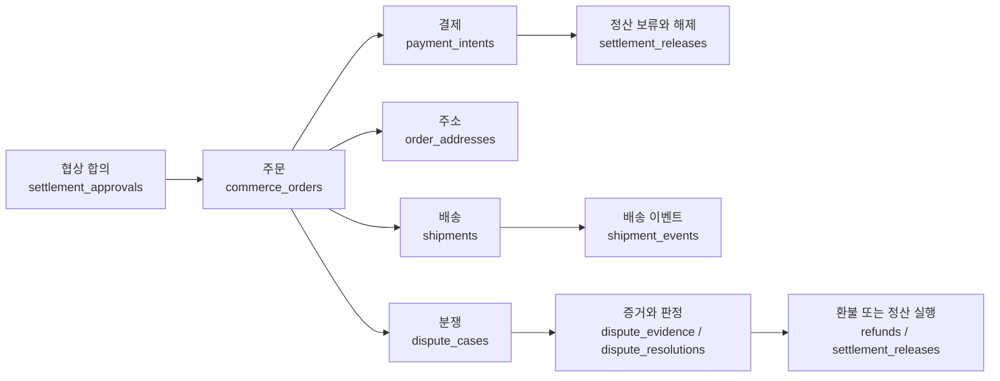

# 거래 DB 구조와 변경 규칙

> 대상: 기획, 운영, 개발. 이 문서는 테이블 정의를 복사하지 않고, 거래 데이터가 어떻게 이어지고 누가 안전하게 바꿀 수 있는지 설명한다.

## 한눈에 보기

Haggle DB는 거래 하나를 여러 장부로 나눈다. 합의 내용, 결제, 배송, 분쟁은 서로 연결되지만 각 영역은 자기 상태만 변경한다. 따라서 결제가 완료됐다고 배송 상태를 직접 덮어쓰거나, 분쟁 결과가 결제 원장을 임의 수정해서는 안 된다.

`order_id`가 거래의 공통 폴더 번호이고, `payment_intent_id`, `shipment_id`, `dispute_id`는 각 전문 장부의 번호다.

## 영역별 책임

| 영역 | 일반적인 뜻 | 핵심 테이블 | 주로 쓰는 코드 |
|------|-------------|-------------|---------------|
| 합의·주문 | 협상에서 확정된 사람, 금액, 조건의 스냅샷 | `settlement_approvals`, `commerce_orders` | settlement/order routes, `payment-record.service.ts` |
| 결제 | 승인, 결제 완료, 실패, 환불과 외부 결제사 참조 | `payment_intents`, `payment_authorizations`, `payment_settlements`, `refunds` | payment routes/services, chain handlers, expiry/reconciliation jobs |
| 정산 | 배송·검토·분쟁이 끝날 때까지 상품대금과 배송 버퍼를 관리 | `settlement_releases` | `settlement-release.service.ts`, auto-release/reconciliation jobs |
| 배송 | 주문별 주소, 요금, 라벨, 추적 이벤트와 사후 운임 조정 | `order_addresses`, `shipments`, `shipment_events`, shipping/APV tables | shipment routes/services, EasyPost webhook, SLA jobs |
| 분쟁 | 사건, 양측 증거, AI/사람 검토, 항소와 최종 판정 | `dispute_cases`, `dispute_evidence`, `dispute_resolutions`, appeal/deposit tables | dispute/reviewer routes, dispute services/jobs/chain handler |
| 운영·감사 | 중복 요청 차단, webhook 기록, 관리자 작업, telemetry | idempotency, admin, reconciliation, telemetry tables | API middleware, jobs, admin services |

현재 API의 비테스트 코드에서 핵심 객체 사용처는 합의 6개 파일, 주문 11개, 결제 6개, 정산 4개, 배송 11개, 분쟁 7개다. 즉 이 DB는 테스트 전용이 아니라 실제 API 흐름의 중심이다.

## 무엇이 진실의 원천인가

1. `packages/db/drizzle/*.sql`과 `meta/_journal.json`: 새 환경에 실제로 적용되는 **배포 이력 SOT**.
2. `packages/db/src/schema/*.ts`: 애플리케이션이 타입 안전하게 읽고 쓰는 **현재 ORM 모델**.
3. `apps/api/src/routes`와 `services`: 상태를 누가 어떤 순서로 바꾸는지 정하는 **행동 SOT**.
4. 이 문서: 사람이 흐름과 변경 규칙을 찾는 **설명용 지도**.

### 기존 staging과 이 PR의 차이

2026-07-14 빈 DB replay 기준 기존 `staging`은 migration 31개와 public table 80개다. 이 PR은 migration 142개와 public table 145개로 확장한다. 추가된 65개는 결제·배송 APV·분쟁 증거/감사·운영 보안 테이블이다.

현재 145개 중 122개는 TypeScript `pgTable`로 관리하고, 배송 APV 복구/경보 운영 테이블 23개는 raw SQL로 관리한다. 분쟁 증거 provenance, scanner circuit/permit, retention 상태 테이블 4개는 기존 이름과 SQL 서비스를 유지한 채 ORM에 편입했다. raw SQL 예외의 영역과 소유자는 `packages/db/schema-ownership.json`이 단일 목록이다. `pnpm verify:db-schema`는 다음을 CI에서 검사한다.

- 동일 테이블의 Drizzle 중복 선언 금지
- Drizzle 선언은 migration과 schema barrel, `drizzle.config.ts`에 모두 존재
- raw SQL 전용 테이블은 정확히 한 영역의 소유 목록에 존재
- 과거 self-healing migration의 반복 `CREATE TABLE` 5개 외에는 중복 생성 금지
- migration rename과 Drizzle snapshot chain 일치

## 보호 경계: 임의 변경 금지

기존 `DO NOT TOUCH`는 변경 자체를 금지하는 말이 아니다. 아래 확인 없이 공유 계약을 바꾸지 말라는 뜻이다.

1. 변경 전 `rg`로 테이블·컬럼의 API, Web, job, contract 소비자를 찾는다.
2. 기존 column/table을 바로 삭제하거나 rename하지 않는다. 새 필드 추가 → 소비자 전환 → 데이터 backfill → 구 필드 제거를 별도 단계로 나눈다.
3. 이미 커밋되거나 적용된 migration 파일은 내용·이름·순서를 바꾸지 않는다.
4. 변경은 새 migration으로 만들고 `pnpm verify:migrations`, `pnpm verify:db-schema`, `pnpm verify:db-invariants`, typecheck/test, 빈 DB replay를 통과시킨다.
5. 결제 금액, 정산, 환불, 분쟁 판정 데이터는 idempotency와 감사 이력을 함께 검토한다.
6. 주소, 전화번호, 이메일, 결제 provider context, 분쟁 증거 URI는 민감 정보다. 일반 API 응답·로그·대시보드에 원문을 노출하지 않는다.

## Migration 번호 충돌 방지

과거 병렬 브랜치 merge 때문에 숫자 prefix가 겹친 이력이 7개(`0002`, `0004`, `0005`, `0024`~`0027`) 있다. 적용 이력 보전을 위해 이 파일들은 rename하지 않는다.

이 중복 때문에 journal의 다음 index는 140이므로 reconciliation migration은 `0140`을 사용한다. `0133`~`0139`가 없는 것은 누락이 아니라 파일 prefix와 journal index를 다시 일치시킨 결과다.

- 새 migration은 최신 `staging`을 반영한 뒤 생성한다.
- `pnpm verify:migrations`는 과거 7개 조합만 allowlist로 허용하고 새로운 중복 prefix, journal tag/index 중복, 순서 누락을 실패 처리한다.
- 충돌을 늦게 발견해도 적용된 파일 번호를 고치지 않는다. 현재 이력을 유지하고 다음 고유 번호 migration으로 보정한다.

## 구조 검토 결과와 개선 순서

### 핵심 거래 연결 강화 상태

빈 DB replay로 확인한 기존 FK는 57개다. 주문→결제, 주문→배송, 주문→분쟁, 분쟁→증거/판정의 핵심 연결은 이미 DB가 강제한다. 이전 문서의 "연결 다수가 FK 없이 애플리케이션에만 의존한다"는 설명은 실제 constraint보다 과도했다.

이번 변경은 정산 release, agent payment grant/disclosure, 배송 APV 장부의 실제 누락 관계 16개를 추가한다. 기존 데이터 때문에 배포가 중단되지 않도록 `NOT VALID`로 추가하지만 신규 쓰기에는 즉시 적용된다. 관계 목록과 소유자는 `packages/db/transaction-relations.json`이 관리한다.

운영 순서:

1. migration `0141_transaction_relation_integrity`를 staging에 적용한다.
2. staging의 `DATABASE_URL`을 안전한 환경 변수로 주입하고 `pnpm db:audit:relations`를 실행한다.
3. orphan이 있으면 삭제하지 말고 해당 `owner`의 서비스 흐름과 원본 장부를 확인해 backfill하거나 명시적인 예외 처리한다.
4. 16개 관계가 모두 `orphans=0`이면 후속 migration에서 `VALIDATE CONSTRAINT`를 실행한다.
5. `pnpm db:audit:relations -- --require-validated`가 통과한 뒤 main에 적용한다.

`--json` 옵션은 배포 증빙 저장용 구조화 결과를 출력한다. 명령은 DB URL이나 행의 실제 식별자를 출력하지 않는다.

### P1: Raw SQL 운영 테이블의 점진적 ORM 편입

기존 27개 운영 테이블 중 분쟁 증거 영역 4개를 먼저 편입해 23개가 남았다. 남은 배송 APV 경보/복구 테이블도 실제 테이블 이름과 raw SQL 서비스를 유지하면서 자주 조회되는 장부부터 `packages/db/src/schema`에 선언한다. 편입할 때 `schema-ownership.json`의 예외를 같은 변경에서 제거한다.

### P1: 큰 스키마 파일과 큰 배포 단위

`shipments.ts`는 약 500줄, `disputes.ts`는 약 410줄이다. 테이블 이름을 바꾸지 않고 quote/label/tracking/APV, case/evidence/assessment/appeal 단위 파일로 나누면 소유권과 리뷰 범위가 선명해진다. 새 기능은 수십 개 migration을 한 PR에 누적하지 않고 독립 배포 가능한 작은 slice로 제한한다.

### P2: 상태와 금액 의미를 더 명확히

주문·결제·배송·분쟁에 각각 status가 있으므로 한 테이블이 다른 영역 status를 직접 수정하지 않게 전이 소유자를 명시해야 한다. 대시보드는 여러 원장을 덮어쓰지 말고 읽기 전용 transaction summary를 조합한다. 모든 금액은 `currency + amount_minor`를 함께 다루고, USD cents와 USDC atomic unit의 소수 자릿수는 shared money 계약에서 명시한다.

## 변경 리뷰 체크리스트

- [ ] 사용자에게 보이는 거래 흐름과 상태 소유자가 유지되는가?
- [ ] 기존 API, job, webhook, dashboard 소비자를 모두 찾았는가?
- [ ] 새 migration 번호와 journal이 유일하고 순차적인가?
- [ ] 기존 migration을 수정하지 않았는가?
- [ ] 금액, idempotency, 개인정보, 감사 이력 영향을 확인했는가?
- [ ] 빈 DB와 기존 DB 양쪽의 적용 경로를 검증했는가?
