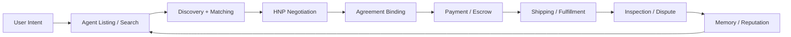
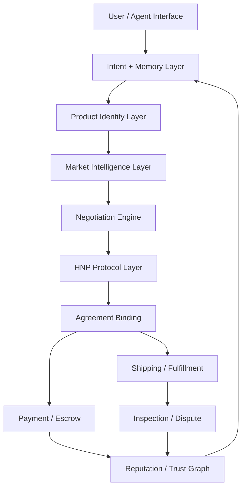

# Agent-Native Marketplace Insights

Date: 2026-04-28

## Scenario

Assumption: sellers and buyers eventually do not manage listings, offers, shipping, and follow-up manually. A user can say "sell this" or "find me one", and an agent handles listing creation, search, negotiation, checkout, shipping, dispute support, and post-sale coordination.

In that world, Haggle should not be only a negotiation UI. It should become an agent-native commerce coordination layer.

## Core Insight

The winning system is not just the best negotiator. It is the system that can safely delegate the whole transaction lifecycle while preserving user intent, trust, reversibility, auditability, and cross-agent interoperability.

## What Needs To Evolve

### 1. Intent Capture

Agents need to understand what the user actually wants before entering the market.

For buyers:

- product target
- budget ceiling and target
- must-have conditions
- acceptable substitutions
- delivery constraints
- risk tolerance
- approval thresholds

For sellers:

- item identity
- condition evidence
- minimum acceptable price
- urgency
- bundling options
- return policy
- shipping constraints
- approval thresholds

The product should make intent durable, queryable, and correctable. This is where HIL memory matters.

### 2. Agent-Created Listings

If agents create listings, the hard problem becomes listing truthfulness and evidence quality.

Required capabilities:

- image-based item recognition
- condition extraction
- serial/model/storage/color normalization
- defect detection
- market price estimate
- listing title and description generation
- required disclosure checklist
- evidence bundle attached to listing

Differentiator: do not just generate listings. Generate verifiable listings.

### 3. Product Identity And Variant Resolution

The iPhone 15 vs iPhone 14 example becomes much harder at scale.

The system needs a product identity layer:

- canonical product family
- model
- variant dimensions such as storage, color, carrier lock, condition, region
- compatible substitutes
- disqualifying differences
- price impact per variant

This should not be purely rule-based. It needs deterministic schemas plus retrieval, embeddings, market data, and uncertainty scoring.

### 4. Negotiation Protocol

HNP should become the neutral wire protocol for agent-to-agent bargaining.

It should cover:

- message identity
- proposal identity
- multi-issue terms
- signatures
- ordering
- expiration
- capability negotiation
- accept binding
- errors and escalation

It should not cover:

- private user memory
- Haggle scoring internals
- buddy character style
- hidden strategy
- proprietary marketplace ranking

### 5. Agreement Binding

As automation increases, "we agreed" must become machine-verifiable.

The agreement should bind:

- exact item
- exact variant
- price
- included accessories
- condition representation
- delivery terms
- payment terms
- inspection window
- return/dispute terms
- proposal hash
- both parties' signatures

This is where HNP connects to checkout and escrow.

### 6. Payment And Escrow

If agents complete transactions, payment must be policy-controlled.

Needed:

- pre-authorization
- spend limit
- human approval threshold
- escrow state
- settlement trigger
- refund path
- chargeback/dispute evidence
- seller payout timing

Negotiation cannot be isolated from settlement. The final accepted proposal must be settlement-ready.

### 7. Shipping And Fulfillment

Shipping automation needs its own contract layer.

Needed:

- address privacy controls
- shipping method selection
- label purchase
- pickup/dropoff coordination
- tracking event ingestion
- delivery confirmation
- insurance
- failed delivery handling

Future extension: a fulfillment capability handshake similar to HNP capabilities.

### 8. Dispute And Inspection

More automation creates more need for structured dispute handling.

Needed:

- condition-at-listing evidence
- condition-at-arrival evidence
- inspection checklist
- mismatch taxonomy
- partial refund negotiation
- return shipping workflow
- arbitration packet

This should feed reputation and future agent behavior.

### 9. Reputation And Trust Graph

Agent-native commerce needs trust beyond user star ratings.

Track:

- agent identity
- seller truthfulness
- buyer payment reliability
- cancellation behavior
- dispute outcomes
- evidence quality
- protocol compliance
- settlement completion rate

This becomes a market-level defense against bad automation.

### 10. Policy And Permission System

Users need granular delegation.

Examples:

- "Negotiate up to $500 automatically."
- "Ask me before accepting anything over $450."
- "Do not buy if battery health is below 90%."
- "Do not sell below $700 unless buyer pays shipping."
- "Only use insured shipping."

The key is not full automation. The key is bounded autonomy.

## Strategic Differentiation

Haggle can differentiate on five layers:

1. Memory-grounded intent

   Remember buyer/seller preferences across sessions, but keep memory outside the public protocol.

2. Neutral protocol

   Make HNP broad enough that other agents can use it without adopting Haggle's app or engine.

3. Verifiable listing and agreement

   Turn images, descriptions, condition, and accepted terms into evidence-backed transaction objects.

4. Human-in-the-loop autonomy

   Let users delegate safely with approval boundaries, not all-or-nothing automation.

5. Transaction lifecycle coverage

   Connect negotiation to payment, shipping, inspection, dispute, and reputation.

## Product Architecture Implication

## Near-Term Build Priorities

1. Canonical HNP core and conformance suite
2. Product identity and variant resolver
3. Memory-backed buyer/seller intent profiles
4. Agreement object that binds proposal, item, price, and conditions
5. Listing evidence bundle
6. Payment approval thresholds
7. Shipping term schema
8. Dispute evidence schema
9. Trust graph primitives
10. Transaction handoff packet

## Implementation Status

1. Canonical HNP core and conformance suite

   Status: implemented foundation. HNP now has canonical core payloads, capability discovery fields, issue registry helpers, proposal hash binding, legacy adapter tests, API ingress tests, and conformance kit coverage.

2. Product identity and variant resolver

   Status: implemented foundation. `product-identity-resolver.service.ts` extracts canonical family/model/variant/storage/battery/carrier signals and classifies selected-vs-remembered products as `exact`, `variant`, `related`, `different`, or `unknown`.

3. Memory-backed buyer/seller intent profiles

   Status: started. Advisor memory is structured into active intent, product-scoped requirements, global preferences, pending slots, discarded signals, and lifecycle state. Long-term promotion remains HIL-controlled.

4. Agreement object that binds proposal, item, price, and conditions

   Status: implemented foundation. HNP accept can produce and validate a machine-verifiable agreement object with accepted proposal id/hash, accepted issue snapshot, settlement preconditions, parties, listing evidence hash, payment policy hash, and shipping terms hash.

5. Listing evidence bundle

   Status: implemented foundation. `protocol/listing-evidence.ts` defines product identity subject, evidence items, claims, bundle hash generation, and validation for duplicate evidence ids, invalid hashes, unknown claim sources, and tampering.

6. Payment approval thresholds

   Status: implemented foundation. `protocol/approval-policy.ts` defines spend delegation policy, policy hash generation, validation, and deterministic evaluation into `AUTO_APPROVE`, `HUMAN_APPROVAL_REQUIRED`, or `BLOCKED` based on currency, approval threshold, hard limit, escrow, and refund path requirements.

7. Shipping term schema

   Status: implemented foundation. `protocol/shipping-terms.ts` defines hash-bound carrier delivery, local pickup, seller dropoff, payer, cost, insurance, tracking, pickup window, delivery SLA, and risk transfer terms with validation for carrier/tracking requirements and tampering.

8. Dispute evidence schema

   Status: implemented foundation. `protocol/dispute-evidence.ts` defines agreement-bound dispute evidence packets with reason, requested resolution, requested adjustment, condition/payment/tracking evidence, inspection findings, source citations, packet hash generation, and validation for tampering or missing evidence.

9. Trust graph primitives

   Status: implemented foundation. `protocol/trust-graph.ts` defines hash-bound trust events for protocol compliance, settlement, cancellation, dispute, evidence quality, and payment reliability, plus deterministic weighted score/confidence aggregation per buyer, seller, agent, or mediator.

10. Transaction handoff packet

   Status: implemented foundation. `protocol/transaction-handoff.ts` links agreement hash, listing evidence, payment approval policy, shipping terms, dispute packets, trust events, required human approvals, blocking reasons, and next action into one handoff object that settlement, fulfillment, dispute, or reputation systems can read next. It can build a handoff from payment/dispute signals, derive the next status, store the operational action, validate status transitions, validate an entire handoff chain with indexed error reporting, and summarize only valid chains with a stable chain hash.

## Concrete Example

Buyer instruction: "Find an iPhone 15 under $500."

1. Product identity confirms the selected listing is an iPhone 15 rather than an iPhone 14 or another variant.
2. HNP negotiation binds the accepted proposal into an agreement hash.
3. Payment policy evaluates the final $480 price as `AUTO_APPROVE`.
4. Transaction handoff becomes `ready_for_settlement` with next action `prepare_settlement`.
5. After settlement completes, the next handoff becomes `settled` with next action `record_settlement_complete`.
6. The handoff chain summary is created only if every handoff is valid, every transition stays on the same agreement hash, and time moves forward.

The production HNP accept route now returns the same operational handoff shape with the agreement:

- `agreement`: the accepted proposal, price, parties, accepted issues, and agreement hash.
- `transaction_handoff`: the next machine-readable transaction state, currently `ready_for_settlement / prepare_settlement` after HNP accept.
- `transaction_handoff_summary`: a compact valid-chain summary containing current status, next action, handoff hashes, and chain hash.
- `transaction_signals`: optional API input for payment/dispute/trust signals. For example, `payment_decision: HUMAN_APPROVAL_REQUIRED` yields `needs_human_approval / request_human_approval` instead of always moving to settlement.

The production HNP offer route also computes a canonical `proposal_hash` when an external agent omits one. It uses proposal id, issues, total price, expiry, and settlement preconditions, then stores and returns the hash before the round is persisted. Example: `iPhone 15 / 128GB / USD 480 / escrow_authorized` becomes a stable `sha256:...` proposal binding that a later accept can reference. The hash normalizes issue order and settlement-precondition order/duplicates, so different agents can serialize the same terms differently without breaking binding. If an external agent provides a hash, the API recomputes it and rejects mismatches before the engine runs.

The accept route also checks repeated issue snapshots against the stored proposal issues. If an agent accepts a `USD 480 / 128GB` proposal hash but repeats `USD 450 / 128GB` in `accepted_issues`, the API rejects it before creating an agreement. This keeps the agreement hash, accepted proposal hash, accepted issues, and downstream payment event aligned.

The `negotiation.agreed` event also uses the agreement object's final accepted price, not the stale session display price. This keeps downstream payment, shipping, and reporting systems aligned to the same accepted proposal.

Settlement preconditions from the accepted HNP proposal are preserved on the agreement object. For example, `escrow_authorized` and `tracked_shipping_required` stay bound to the accepted proposal hash, so checkout and fulfillment can verify their prerequisites before moving money or buying a label.

If an accept payload only references the accepted proposal id/hash, the API falls back to the stored proposal metadata for currency and accepted issues. This prevents a compact accept message from losing terms such as `EUR` pricing or `hnp.issue.delivery.window = 3d`.

If the final price is $530, the handoff becomes `needs_human_approval` or `blocked` depending on the user's policy. A `blocked` chain cannot silently reactivate into settlement.

## Thesis

If agents become the default interface for commerce, negotiation is only the middle of the workflow. The defensible product is a protocol-backed transaction operating system: intent in, verified agreement out, settlement and fulfillment completed with bounded autonomy.
