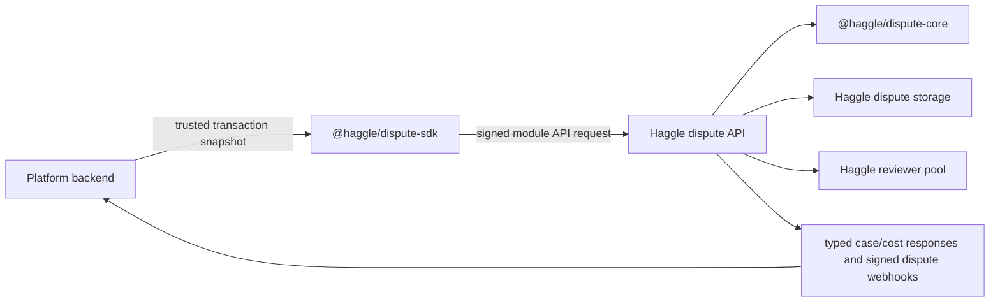

# Dispute SDK Design

## Purpose

`@haggle/dispute-sdk` is the developer-facing layer for platforms integrating Haggle as a modular dispute service.

The SDK should remove integration footguns:

- no copied HMAC signing snippets;
- no hand-built route paths;
- no inconsistent idempotency handling;
- no browser exposure of platform secrets;
- no ambiguity about who owns reviewers, scoring, and settlement decisions.

## Operating Model



The SDK is server-side only. Platform secrets must never be shipped to browsers, mobile apps, embedded widgets, or untrusted clients.

## Current Public Surface

The first SDK surface maps exactly to the module API available today:

| SDK method | API route | Behavior |
| --- | --- | --- |
| `previewCase(input, options)` | `POST /modules/disputes/v1/cases/preview` | Validates transaction/request, derives role, returns costs. |
| `createCase(input, options)` | `POST /modules/disputes/v1/cases` | Opens or replays a module dispute case. |
| `previewEscalation(disputeId, input, options)` | `POST /modules/disputes/v1/cases/:id/escalations/preview` | Returns server-computed next tier cost and seller deposit requirement. |
| `createEscalation(disputeId, input, options)` | `POST /modules/disputes/v1/cases/:id/escalations` | Advances T1→T2 or T2→T3, idempotently. |
| `getCaseStatus(disputeId, input, options)` | `POST /modules/disputes/v1/cases/:id/status` | Returns signed case/tier/cost/deposit status for the platform backend. |
| `buildSignedRequest(method, path, body, options)` | Any supported module route | Produces exact signed body and headers for custom HTTP clients. |
| `buildModuleHeaders(params)` | Low-level helper | Produces HMAC headers for advanced callers. |
| `signModuleRequest(params)` | Low-level helper | Builds `sha256=<hmac>` signature. |

## Input Contract

The platform sends:

- a trusted transaction snapshot from its backend database;
- the actor requesting a dispute;
- a supported Haggle reason code;
- a human-readable summary;
- an idempotency key in request options.

The platform does not send:

- `opened_by`;
- reviewer choices;
- tier costs;
- revenue split;
- settlement outcome;
- final refund amount.

Those are derived or generated by Haggle.

## Runtime Validation

Before signing `previewCase` and `createCase`, the SDK validates:

- `transaction.platform_id` matches the configured client platform id;
- buyer and seller actor ids are present and distinct;
- requester actor id is one of the transaction parties;
- amount is a positive integer;
- currency is an uppercase code;
- transaction status and reason code are supported;
- summary is non-empty;
- the request body is JSON serializable.

For escalation calls, the SDK validates dispute id, external order id, requester actor id, optional target tier, optional reason/client request id, and JSON serializability.

Validation failures throw `HaggleDisputeValidationError` and no request is signed or sent.

## Authentication

The SDK signs the exact JSON body it sends:

```text
<timestamp>.<method>.<path>.<sha256(rawBody)>
```

Headers:

- `x-haggle-module-platform-id`
- `x-haggle-module-timestamp`
- `x-haggle-module-signature`
- `x-haggle-idempotency-key`

The SDK rejects secrets shorter than 16 characters before request signing.

## Transport Security

SDK defaults must protect the platform secret during transport:

- `baseUrl` must be HTTPS by default.
- Plain HTTP requires `allowInsecureHttp: true` and should be used only for local development.
- `baseUrl` must not include URL credentials, query strings, or fragments.
- SDK `fetch` requests use `redirect: "error"` so signed module headers are not forwarded through redirects.
- Requests have a finite timeout so backend jobs do not hang while holding retry/idempotency workflow state.
- A redaction helper is available for logs; full HMAC signatures should never be logged.

## Idempotency

Idempotency is caller controlled but Haggle enforced.

The SDK requires `idempotencyKey` for `previewCase` and `createCase`. The API persists create idempotency by:

- `platform_id`;
- idempotency key;
- canonical request fingerprint;
- resulting dispute id.

The SDK documentation instructs integrators to keep the same key and same body for retries. Reusing a key with a different body returns `IDEMPOTENCY_KEY_REUSED`.

## Errors

API errors are wrapped in `HaggleDisputeApiError` with:

- `status`
- `code`
- `body`
- `requestId`

This keeps product workflows from parsing raw response objects.

Successful HTTP responses are also validated before returning to callers. The SDK checks:

- `platform_id` matches the configured client platform id;
- `external_order_id` matches the request transaction;
- `idempotency_key` matches the request option;
- preview cost/config fields are well-formed, including exactly one preview for tiers 1, 2, and 3;
- create responses include a usable dispute object.
- escalation responses match platform/order/dispute ids, advance by one tier, include a valid cost, and include a valid seller deposit requirement;
- status responses match platform/order/dispute ids and expose well-formed current tier/deposit fields.

Malformed or mismatched success responses throw `HaggleDisputeResponseValidationError`.

## Reviewer And Money Boundary

Haggle owns:

- reviewer pool selection;
- review aggregation;
- reviewer payout rules;
- platform/reviewer share policy;
- final settlement instruction generation.

Platform owners keep:

- their own order state;
- user authentication;
- payment rails and ledger application;
- UX around opening and viewing disputes.

The SDK exposes `SettlementInstructionWebhookData` for signed webhook outputs. It is not returned by case or escalation request methods; those methods only return immediate API responses. Settlement instruction webhook data contains the final outcome plus a nested `settlement_instruction` with `action`, `amount_minor`, and `currency`.

## Webhook Output Verification

The SDK provides forward-compatible primitives for platform webhook receivers:

- `signDisputeWebhookPayload`
- `verifyDisputeWebhook`
- `validateDisputeWebhookEnvelope`
- `validateSettlementInstruction`
- `validateSettlementInstructionWebhookData`

Webhook signatures bind:

```text
<timestamp>.<eventId>.<sha256(rawBody)>
```

The verifier requires the exact raw request body, rejects stale timestamps, rejects invalid signatures with timing-safe comparison, validates the event envelope, and can enforce expected `platform_id`. Settlement instruction webhook validation checks the enclosing dispute id, final outcome, tier, refund amount, and nested action/amount/currency fields.

## Documentation Structure

Documentation now has two layers:

- `packages/dispute-sdk/README.md`: quick start, API reference, security notes, examples.
- `packages/dispute-sdk/docs/integration-guide.md`: backend integration checklist, data mapping, idempotency matrix, operations.

## Review Notes

- SDK reason-code types must mirror `@haggle/dispute-core`.
- The SDK must not type-allow values the API rejects.
- SDK runtime validation is a developer safety layer, not the source of policy truth. The API remains authoritative.
- The generated `body` returned by `buildSignedRequest` is the canonical signed body and must be sent unchanged.
- Documentation should avoid implying that preview moves money; preview only returns cost and policy summary.
