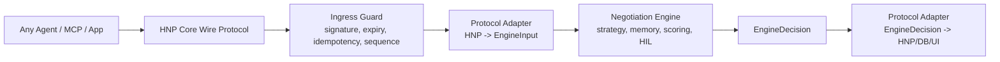

# HNP Standardization Review

Date: 2026-04-28

## Position

HNP is a reasonable starting point for a neutral negotiation protocol, but it should be treated as a protocol core plus extension model, not as Haggle product API shape.

The current strongest parts are:

- Transport-neutral envelope: `rest`, `mcp`, `grpc`, `ws`, `a2a`.
- Agent-neutral identity: `sender_agent_id`, `sender_role`, detached signature.
- Domain-neutral proposal payload: issue list plus typed money.
- Reliability primitives: `message_id`, `idempotency_key`, `sequence`, `expires_at_ms`.
- Explicit terminal/control messages: `ACCEPT`, `REJECT`, `ESCALATE`, `ACK`, `ERROR`.

## Standardization Checks

| Criterion | Current State | Verdict |
| --- | --- | --- |
| Transport neutrality | Envelope supports multiple transports. | Good |
| Vendor neutrality | No Haggle-specific field is required in `core.ts`. | Good |
| Currency safety | Minor units avoid float errors. | Good |
| Multi-issue negotiation | Generic `issues[]` exists. | Good, needs richer schema |
| Extensibility | `capability` and open `spec_version` exist. | Partial |
| Identity trust | Detached JWS exists and can be required. | Good |
| Replay/idempotency | Message id, idempotency key, sequence are guarded. | Good |
| Privacy/data minimization | No required memory/user profile fields. | Good |
| Domain schemas | Issue semantics are not registry-backed yet. | Gap |
| Compatibility negotiation | Capability constant exists, but no handshake payload yet. | Gap |
| Error taxonomy | Core errors exist. | Good, still small |

## Gaps Before Calling It A Standard

1. One canonical wire type family

   `packages/engine-session/src/protocol/core.ts` should be the source of truth. The older `protocol/types.ts` shape should become a compatibility adapter or be deprecated.

2. Extension registry

   `issues[]` is flexible, but standardization needs a neutral way to define issue namespaces:

   - `hnp.issue.price.total`
   - `hnp.issue.condition.grade`
   - `hnp.issue.delivery.window`
   - vendor extensions such as `com.vendor.issue.trade_in`

3. Capability handshake

   Agents need to discover compatible protocol features before negotiation:

   - supported revisions
   - supported transports
   - supported issue namespaces
   - supported signature algorithms
   - supported settlement modes

4. Policy separation

   The wire protocol should not encode Haggle strategy, memory, character tone, or scoring thresholds. Those belong in the engine/application layer.

5. Conformance suite

   A standard needs tests that third parties can run:

   - valid envelope examples
   - invalid signature examples
   - out-of-order examples
   - idempotent retry examples
   - multi-issue proposal examples
   - accept-by-proposal binding examples

## Target Layering

## Conclusion

HNP is broad and neutral enough as a core envelope, but not yet complete enough as an industry standard. The next standardization work should be issue registry, capability handshake, one canonical wire model, and a conformance test kit.

## Implementation Order

1. Make `HnpEnvelope` the canonical wire model

   Status: started. Core wire types now include capability handshake payloads, proposal hash fields, and proposal binding helpers.

   `packages/engine-session/src/protocol/core.ts` becomes the only normative HNP core type family. Older `HnpMessage` shapes should move behind compatibility adapters.

2. Deprecate legacy `HnpMessage`

   Status: started. Legacy `HnpMessage` is marked deprecated and converted through `protocol/legacy-adapter.ts`.

   Keep legacy support only at the adapter boundary. New code should use `HnpEnvelope`, `HnpCoreMessageType`, `HnpMoney`, and core payload types.

3. Add `HELLO` / `CAPABILITIES`

   Status: started. Core payload types exist and `/.well-known/hnp` advertises issue namespaces, signature algorithms, and settlement modes.

   Agents should exchange supported protocol revisions, transports, signature algorithms, issue namespaces, settlement modes, and required extensions before negotiation starts.

4. Add neutral issue registry

   Status: started. Core issue ids and namespace validation helpers exist in `protocol/issue-registry.ts`.

   Define stable issue ids such as:

   - `hnp.issue.price.total`
   - `hnp.issue.condition.grade`
   - `hnp.issue.condition.battery_health`
   - `hnp.issue.delivery.window`
   - `hnp.issue.warranty.remaining`
   - `hnp.issue.bundle.accessory`
   - `hnp.issue.payment.method`

   Vendor-specific fields should use reverse-DNS namespaces such as `com.haggle.issue.memory_hint`.

5. Strengthen proposal binding

   Status: implemented foundation. `proposal_hash`, `accepted_proposal_hash`, accepted issue snapshots, settlement preconditions, API accept hash matching, agreement object generation, and agreement object validation are supported. When an HNP offer omits `proposal_hash`, the production offer route now computes a canonical hash from proposal id, issues, total price, expiry, and settlement preconditions, stores it in round protocol metadata, and returns it in the API response. When an HNP offer provides `proposal_hash`, the route recomputes the canonical hash and rejects mismatches before session lookup or engine execution. On accept, if the payload repeats `accepted_issues`, the route compares them with the stored proposal issues and rejects conflicting snapshots before creating an agreement. Issue order and settlement-precondition order/duplicates are normalized before hashing.

   Add proposal hash, accepted issue snapshot, expiry binding, and settlement preconditions so `ACCEPT` binds to an exact set of terms.

6. Expand error and escalation taxonomy

   Status: implemented foundation. Core error codes include `UNSUPPORTED_ISSUE`, `UNSUPPORTED_CURRENCY`, `EXPIRED_PROPOSAL`, `PROPOSAL_CONFLICT`, `SIGNATURE_REQUIRED`, `SETTLEMENT_UNAVAILABLE`, and `POLICY_BLOCKED`.

7. Add conformance tests

   Status: implemented foundation. `hnp-conformance-kit` validates envelopes, expiry, issue namespace support, vendor namespace declarations, and signature requirement behavior. API route tests cover out-of-order and proposal-hash accept failures.

8. Keep engine policy outside HNP core

   Strategy, memory, scoring thresholds, buddy tone, HIL, and marketplace policy remain application/engine concerns. HNP should carry negotiated terms and protocol metadata, not Haggle's private reasoning state.

9. Add listing evidence binding

   Status: started. `protocol/listing-evidence.ts` defines neutral evidence bundles for listing truth: product identity subject, evidence item references, claim sources, bundle hash generation, and tamper validation. Agreement objects can reference a listing evidence bundle hash without putting private engine state into HNP core.

10. Add downstream transaction term objects

   Status: started. Payment approval policy, shipping terms, dispute evidence packets, and trust graph events now exist as hash-bound protocol-adjacent objects. They keep user policy, transaction lifecycle evidence, and reputation signals structured without placing private engine reasoning inside the HNP core envelope.

11. Add transaction handoff object

   Status: started. `protocol/transaction-handoff.ts` binds the agreement hash to listing evidence, payment policy, shipping terms, dispute packets, trust events, required human approvals, blocking reasons, and next action. This creates a compact machine-readable handoff between negotiation, settlement, fulfillment, dispute handling, and reputation. It can build the handoff from payment/dispute signals, derive the next transaction state, store the next operational action, validate state transitions, validate complete handoff chains with indexed errors, and summarize only valid chains with a stable chain hash.

   Example: an accepted iPhone 15 proposal under the buyer's $500 policy becomes `ready_for_settlement / prepare_settlement`. Once payment is complete it can move to `settled / record_settlement_complete`. If the next object tries to reuse a different agreement hash, move backward in time, or reactivate a blocked transaction, the chain validator rejects it and no summary is produced.

   Integration status: the production HNP accept route now returns the agreement object, a `transaction_handoff`, and a `transaction_handoff_summary` together. It also accepts application-level `transaction_signals` so payment policy can produce `needs_human_approval`, `blocked`, `settled`, or `disputed` handoffs instead of always defaulting to settlement. This makes the protocol-to-engine boundary visible to downstream settlement/fulfillment systems without exposing private strategy or memory internals.

   Event alignment: the downstream `negotiation.agreed` event now uses the agreement object's accepted price, so route response, event payload, and payment handoff reference the same accepted proposal.

   Settlement binding: accepted proposal `settlement_preconditions` now flow into the agreement object. That keeps checkout prerequisites such as escrow authorization or tracked shipping attached to the accepted proposal rather than dropping them at accept time.

   Compact accept safety: when an `ACCEPT` payload only references the proposal id/hash, the API restores accepted issues and currency from the stored proposal metadata. This keeps exact multi-issue terms bound even when the accept message does not repeat every term.

   Accepted issue safety: when an `ACCEPT` payload repeats `accepted_issues`, those issues must match the stored proposal issue snapshot if one exists. Example: accepting the hash for `USD 480 / 128GB` while repeating `USD 450 / 128GB` returns `INVALID_PROPOSAL_ISSUES` instead of producing an inconsistent agreement.

   Offer hash safety: when an `OFFER` payload omits `proposal_hash`, the API computes one before the engine persists the round. Example: `iPhone 15 / 128GB / USD 480 / escrow_authorized` becomes a stable `sha256:...` proposal hash, so a later accept can bind to those exact terms instead of relying only on a human-readable proposal id. If two agents send `escrow_authorized` and `tracked_shipping_required` in different orders, or one repeats a precondition, the hash remains the same as long as the actual terms are the same. If an agent sends a hash that was computed for different terms, the route returns `HNP_PROPOSAL_HASH_MISMATCH`.
